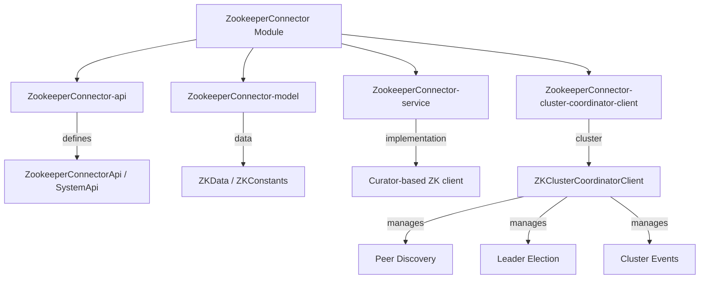
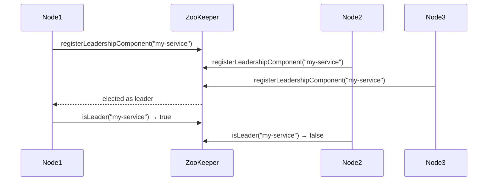
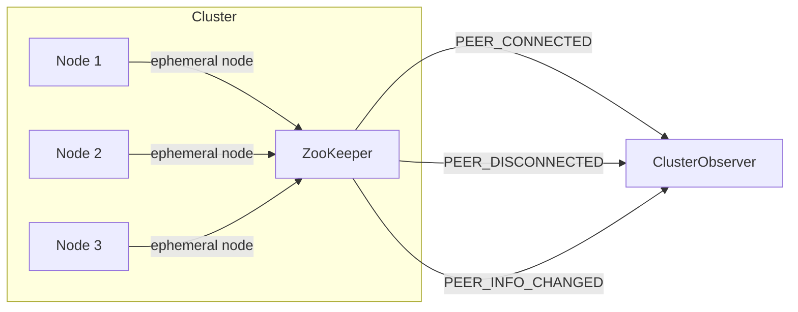

# ZookeeperConnector Module

The **ZookeeperConnector** module provides Apache ZooKeeper integration for the Water Framework, enabling distributed coordination, cluster management, leader election, and peer discovery via Apache Curator recipes.

## Architecture Overview



## Sub-modules

| Sub-module | Description |
|---|---|
| **ZookeeperConnector-api** | Defines `ZookeeperConnectorApi`, `ZookeeperConnectorSystemApi`, and `ZookeeperClient` interfaces |
| **ZookeeperConnector-model** | Data classes: `ZKData` (JSON serialization for ZK nodes), `ZKConstants` (path constants) |
| **ZookeeperConnector-service** | Implementation of Zookeeper operations using Apache Curator |
| **ZookeeperConnector-cluster-coordinator-client** | Cluster coordination: peer registration, event listening, leader election |

## Key Concepts

### ZooKeeper Node Management

The `ZookeeperConnectorSystemApi` provides full ZK node CRUD operations:

| Method | Description |
|---|---|
| `create(CreateMode, String path, byte[] data, boolean createParents)` | Create a ZK node with specified mode |
| `createEphemeral(String path, byte[] data, boolean createParents)` | Create an ephemeral node (auto-deleted on disconnect) |
| `createPersistent(String path, byte[] data, boolean createParents)` | Create a persistent node |
| `read(String path, boolean lock)` | Read node data (optionally with distributed lock) |
| `update(String path, byte[] data)` | Update node data |
| `delete(String path)` | Delete a node |
| `pathExists(String path)` | Check if a path exists |

### Leader Election



Leader election uses Curator's `LeaderLatch` recipe:

```java
// Register for leadership
zookeeperConnectorSystemApi.registerLeadershipComponent("my-service-lock");

// Check leadership
boolean isLeader = zookeeperConnectorApi.isLeader("my-service-lock");

// Listen for leadership changes
zookeeperConnectorSystemApi.addListener(new LeaderLatchListener() {
    public void isLeader() { /* became leader */ }
    public void notLeader() { /* lost leadership */ }
}, "my-service-lock");
```

### Cluster Coordination

The `ZKClusterCoordinatorClient` implements the `ClusterCoordinatorClient` interface for peer-to-peer cluster management:



**Cluster Events:**

| Event | Trigger |
|---|---|
| `PEER_CONNECTED` | A new peer registers an ephemeral node |
| `PEER_DISCONNECTED` | A peer's ephemeral node is deleted (disconnect/crash) |
| `PEER_INFO_CHANGED` | A peer's node data is updated |
| `PEER_CUSTOM_EVENT` | Application-specific event |
| `PEER_DATA_EVENT` | Data broadcast event |
| `PEER_ERROR` | Error event |

**Cluster Operations:**

| Method | Description |
|---|---|
| `registerToCluster()` | Register this node as a cluster peer (ephemeral ZK node) |
| `unregisterToCluster()` | Remove this node from the cluster |
| `getPeerNodes()` | Get all currently connected peers |
| `peerStillExists(ClusterNodeInfo)` | Verify a peer is still alive |
| `checkClusterLeadershipFor(String key)` | Check leadership for a service key |
| `subscribeToClusterEvents(ClusterObserver)` | Subscribe to cluster change events |

### ZKData

`ZKData` provides JSON-based serialization for ZooKeeper node payloads:

```java
ZKData data = new ZKData();
data.put("hostname", "node-01.example.com");
data.put("port", "8080");

// Serialize to bytes for ZK storage
byte[] bytes = data.getBytes();

// Deserialize from bytes
ZKData restored = ZKData.fromBytes(bytes);
```

## Configuration

| Property | Description |
|---|---|
| ZooKeeper connection string | ZK ensemble addresses (e.g., `zk1:2181,zk2:2181`) |
| Session timeout | Curator session timeout |
| Connection timeout | Curator connection timeout |
| Base path | Root ZK path for Water cluster data |

## Usage Example

```java
// Inject the connector
@Inject
private ZookeeperConnectorSystemApi zkSystemApi;

// Create a persistent configuration node
zkSystemApi.createPersistent("/water/config/my-service",
    configData.getBytes(), true);

// Read data
byte[] data = zkSystemApi.read("/water/config/my-service", false);

// Register for leader election
zkSystemApi.registerLeadershipComponent("/water/leaders/my-service");

// Check leadership
@Inject
private ZookeeperConnectorApi zkApi;
if (zkApi.isLeader("/water/leaders/my-service")) {
    // Execute leader-only logic
}

// Cluster coordination
@Inject
private ClusterCoordinatorClient clusterClient;
clusterClient.registerToCluster();
Collection<ClusterNodeInfo> peers = clusterClient.getPeerNodes();
```

## Dependencies

- **Core-api** — Base interfaces and service registration
- **Apache Curator** — ZooKeeper client recipes (leader election, caching, node management)
- **Apache ZooKeeper** — Distributed coordination service
- **Jackson** — JSON serialization for `ZKData`
